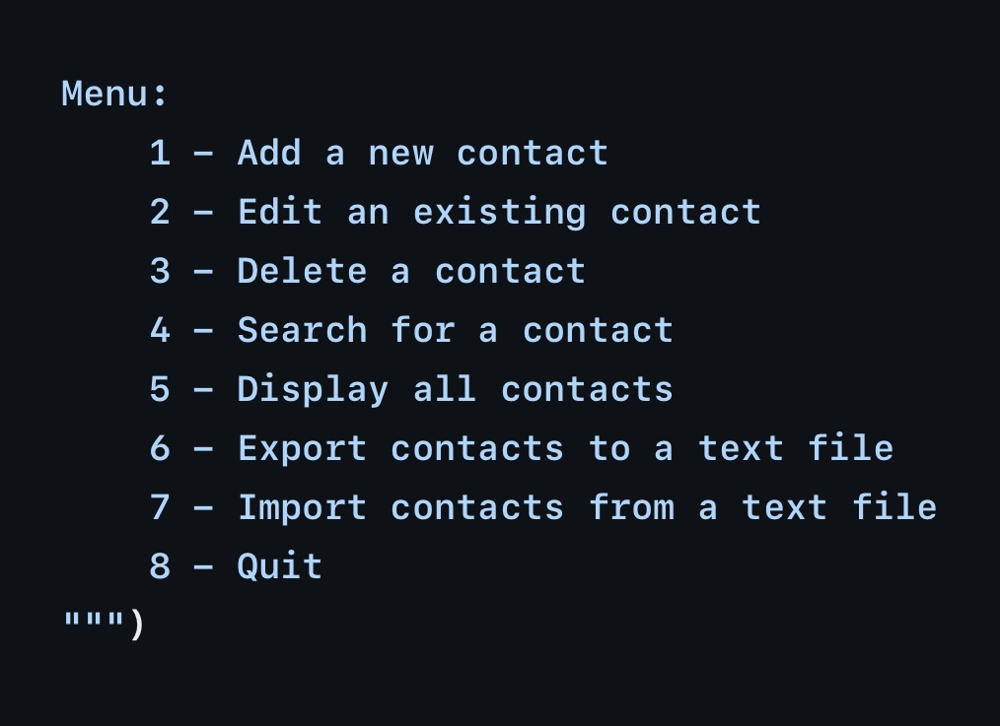

# Mini-project | Contact Management System Application 

**This application allows the user to create and maintain a contact management system. It starts by greeting the user then gives the user a menu to select a choice from on what they would like to do within the application.** _(See welcome message below & picture of the menu for example)_

## _"Welcome to the Contact Management System!"_

**The user will choose a number from the menu and from there they will be prompt to answer questions such as information to add or edit for a contact.**

*Here is an example:*
- when the user chooses to add a new contact they will be asked for an email address, first name, last name, phone number, and asked if this contact should be assigned as ""friend", "family", or "work".

- Then the user will be asked if they would like to add a "custom field category" such as a birthday or anniversary.

- If they user says "yes" they will be asked to enter the "custom field" they wish to be assigned to the contact. 

**Any time the user gets done entering information in a particular area OR if the user enters invalid information it will take them back to the main menu to select a choice. When the user is done using the contact management system they can simply select "8" from the main menu and it will end the application.**

## Special Features:
- The application has checks for valid emails and phone numbers.

- The application even allows the user to import and export contacts!_

*link to GitHub Repository --> [Contact Management System](https://github.com/Kayla-Ard/Contact_Management_System/tree/main/project_*